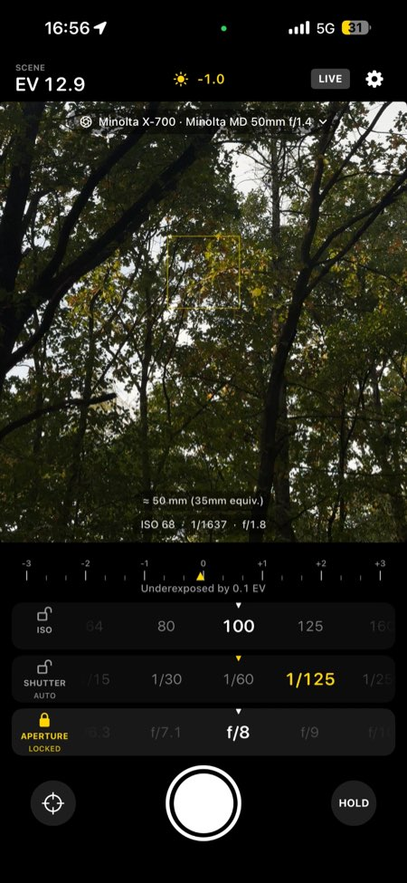
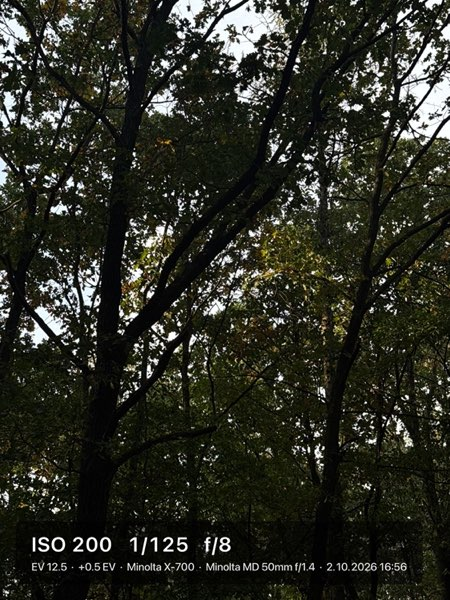

# Better Light Meter

An iPhone light meter for a photographers. Point the phone at the scene and get reading, you can addjust the ISO, shutter speed and aperture combinations that your actual camera and lens can use. You also can take a picture to save it with current settings.

<p align="center">
  
  
</p>

## Features

- **Live metering** from the iPhone camera, shown as scene EV and as a deviation scale.
- **Camera and lens presets** limit ISO, shutter speed and aperture to what your gear supports, including
  full-stop-only shutters and leaf shutters built into the lens, you can add your own for faster access.
- **Lens simulation** adjust viewfinder to simulate selected lens's field of view,in case lens is wider than the iPhone can go are shown with a black border.
- **Camera-style controls**: tap to focus and meter, long press for AE/AF lock, drag up or down for exposure
  compensation, and a hold button to freeze a reading.
- **Photos with the reading printed on them**, saved to the album of your choice, with optional geotag.
- **Custom presets** for camera and it's lens can be imported from [JSON](#presets).
- **Localized**: English, Belarusian, Czech.

## Build

1. Open `BetterLightMeter.xcodeproj` in Xcode.
2. Select your development team under Signing & Capabilities.
3. Run on a device.

<h2 id="presets">Presets</h2>

Built-in presets live in
[`DefaultPresets.json`](BetterLightMeter/Resources/DefaultPresets.json). You can import your own from
Settings → Presets → Import Presets from JSON. Cameras with the same name are replaced.

```json
{
  "cameras": [
    {
      "name": "Leica M6",
      "cropFactor": 1,
      "iso": { "min": 6, "max": 6400 },
      "shutter": { "min": "1", "max": "1/1000", "fullStops": true },
      "lenses": [
        { "name": "Summicron-M 35mm f/2", "focalLength": 35, "aperture": { "min": 2, "max": 16 } }
      ]
    }
  ]
}
```

| Field            | Where  | Meaning                                                                    |
| ---------------- | ------ | -------------------------------------------------------------------------- |
| `iso`, `shutter` | camera | Range, or a single value to fix it. Omit `shutter` for bodies without one. |
| `cropFactor`     | camera | Multiplier against 35mm full frame (default 1).                            |
| `aperture`       | lens   | Aperture range.                                                            |
| `shutter`        | lens   | Leaf shutter built into the lens. Replaces the body's shutter.             |
| `focalLength`    | lens   | In mm. Used for lens simulation.                                           |
| `fullStops`      | range  | Only whole stops are available.                                            |

Values can be numbers or text such as `"1/500"`, `"2s"` or `"f/2.8"`.

## Documentation

See [DOCUMENTATION.md](DOCUMENTATION.md) for how the app works, with a page for each source file.

## License

[PolyForm Noncommercial 1.0.0](LICENSE.md). Free for noncommercial use.
